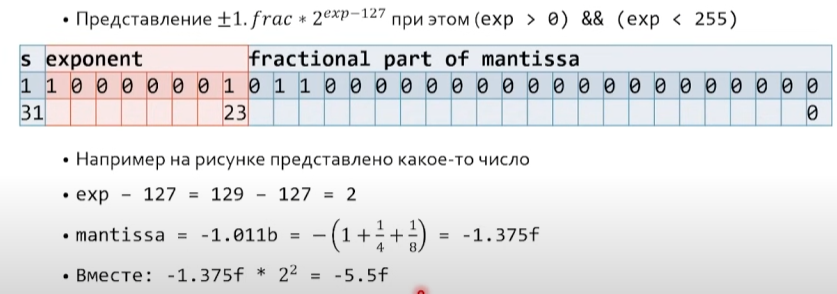

# Семинар 15 - Числа с плавающей точкой

# Семинар 15 - Числа с плавающей точкой

### Проблематика

**Вопрос**: что такое вещественное число?

**Мысль**: вещественное число - функция, которая выдает разряд за разрядом

**Вопрос**: все ли вещественные числа так представимы, если функция конечна?

**Ответ**: с вероятностью 100% любое вещественное число не представимо

Но в компьютере все еще хуже - у нас всего 32 бита

**Вопрос**: как представить вещественные числа? (fixed point)

**Вопрос**: какие проблемы у fixed point?

- большой шаг
- маленькие числа

### Плавающая точка

**Вопрос**: какие числа можем закодировать, если у нас есть 8 разрядов?

IEEE 754 - стандарт **двоичной** плавающей точки

*открываем IEEE 754*



Разбираем идею.

**Задача**: записать число, представленное на картинке

### Про ноль

**Вопрос**: какое число мы не можем представить?

**Вопрос**: какое число самое маленькое? - 2^-126

**Вопрос**: как получаем ноль? что если s = 1?

Если exp = 0, то `+-0.frac * 2^-126` получаем

**Вопрос**: как выглядит функция fabs()

### Про бесконечность


**Вопрос**: влияет ли frac на бесконечность? - влияет

### NaN

NaN не равен ни чему, даже самому себе.

### Теперь вспомним реинтерпретацию.

**Задача**: получить битовое представление frac от float.

**Вопрос**: какие 2 способа у нас были?

На самом деле иметь 2 указателя на одно место нельзя. Кроме char*, sign, const, void*

```c
uint32_t as_uint32(float f) {
    unsigned u;    
    memcpy(&u, &f, sizeof(uint32_t));    
    return u;
 }
```

Это единственный верный способ реинтерпретации.

Вернемся к упражнениям:

**Задача**: чему равно 3f800000? - 1.0f

**Задача**: как получить 2.0f? - 4000000

**Задача**: как получить 4.0f? - 4080000

**Задача**: как получить 3.0f? - 4040000

**Задача**: как эти числа расположены на числовой прямой? Нарисуйте. - 0.0625 0.125 0.25 0.5 1 2 4 8

**Задача**: как записать 0.1f?

0|0111 1011|1001 1001 1001 1001 1001 101


**Extra вопрос**: ассоциативно ли сложение fp чисел? - **нет**. Однако есть -ffast-math.